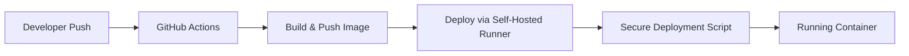

# Audio Streaming Web App - Deployment Template

**Purpose:** This is a template repository that demonstrates how to set up a CI/CD pipeline for deploying web applications to `arrnc-api.ccbs.ed.ac.uk` using Docker, GitHub Actions, and a self-hosted runner. Use this as a starting point for new projects or as a reference for adding deployment capabilities to existing repositories.

This repository contains a basic web application for streaming audio files, containerized with Docker, and deployed using GitHub Actions to `arrnc-api.ccbs.ed.ac.uk`.

## Quick Start

**Using this template:**

1. **Fork or use as a template** for your project
2. **Customize the application code** in the `app/` directory
3. **Update the Dockerfile** if your application has different requirements
4. **Configure the workflow** in `.github/workflows/main.yml` to match your project
5. **Contact the server administrator** to get deployment access

**Using as a reference for existing projects:**

1. **Copy the workflow** from `.github/workflows/main.yml` to your existing repository
2. **Adapt the Dockerfile** patterns for your application
3. **Review the deployment parameters** below
4. **Contact the server administrator** to get deployment access

## Critical Requirements

⚠️ **Container names must be either `production-api` or `dev-api` only.** The server-managed deployment script will refuse any other container names. This restriction exists because:

- `production-api` containers are served at the production URL
- `dev-api` containers are served at the development URL

⚠️ **Contact the server administrator** to:

- Get your project whitelisted for deployment on `arrnc-api.ccbs.ed.ac.uk`
- Register a self-hosted runner for your repository
- Add deployment bot credentials to your repository secrets
- Configure host port assignments and persistent storage paths
- Set up MS SQL Server connectivity (if needed)

## How the Deployment Pipeline Works



**The pipeline flow:**

1. **Push to GitHub**: When you push to a configured branch (e.g., `main` or `dev`), the GitHub Actions workflow is triggered
2. **Build and Push**: The `build-and-push` job builds a Docker image and pushes it to GitHub Container Registry (ghcr.io)
3. **Deploy**: The `deploy` job runs on the self-hosted runner at `arrnc-api.ccbs.ed.ac.uk`
   - For security, the runner doesn't have direct Docker access
   - Instead, it calls the `container-web-deploy` script (maintained by the server administrator)
   - The script acts as a secure gatekeeper, validating inputs and executing Docker commands

## Understanding the GitHub Actions Workflow

The `.github/workflows/main.yml` file contains two distinct jobs that run sequentially:

### Workflow Triggers (Customizable)

The example workflow triggers on pushes to `main` and `dev` branches, but this can be adapted to your needs:

- **Different branches**: `push: branches: [production, staging, feature/*]`
- **Manual triggers**: `workflow_dispatch:` for on-demand deployments
- **Tag-based releases**: `push: tags: ['v*']` for version-based deployments  
- **Pull request builds**: `pull_request:` for testing before merge
- **Scheduled deployments**: `schedule:` with cron expressions
- **Multiple triggers**: Combine any of the above

*See the [GitHub Actions documentation](https://docs.github.com/en/actions/using-workflows/events-that-trigger-workflows) for all trigger options.*

### Job 1: `build-and-push`

**Purpose**: Builds your Docker image and pushes it to GitHub Container Registry (ghcr.io)

**Key Steps**:

- Checks out your code
- Sets up Docker Buildx for advanced building features  
- Logs into GitHub Container Registry using `GITHUB_TOKEN`
- Builds the Docker image using your `Dockerfile`
- Tags the image with the branch name (e.g., `main`, `dev`)
- Pushes the image to `ghcr.io/your-username/your-repo:branch-name`

**Customization Options**:

- Add additional build arguments to the Docker build step
- Include security scanning steps
- Add image optimization or multi-platform builds
- Customize image tags or add additional tags

### Job 2: `deploy`

**Purpose**: Deploys your container to `arrnc-api.ccbs.ed.ac.uk`

**Key Steps**:

- Runs on the self-hosted runner (physically located on the deployment server)
- Determines container name based on the branch (`main` → `production-api`, `dev` → `dev-api`)
- Calls the server-managed `container-web-deploy` script
- Passes the container name and image URL to the deployment script

**Branch to Container Mapping** *(Customizable with server administrator approval)*:

- `main` branch → `production-api` container
- `dev` branch → `dev-api` container
- Other branches → No deployment (workflow will skip the deploy job)

*Note: This mapping can be customized to use different branch names or trigger patterns, but requires coordination with the server administrator to ensure proper URL routing.*

## Customizing the Workflow

The GitHub Actions workflow is highly adaptable to your project's needs:

### Workflow Trigger Examples

```yaml
# Manual deployment trigger
on:
  workflow_dispatch:
    inputs:
      environment:
        description: 'Deployment environment'
        required: true
        default: 'dev'
        type: choice
        options:
        - dev
        - production

# Tag-based releases
on:
  push:
    tags:
      - 'v*'

# Multiple triggers
on:
  push:
    branches: [main, dev]
  workflow_dispatch:
  schedule:
    - cron: '0 2 * * 1'  # Weekly Monday 2 AM deployment
```

### Deployment Step Customization

**Pre-deployment steps:**

- Add database migrations
- Run health checks
- Validate configurations

**Post-deployment steps:**

- Verify deployment success
- Run integration tests
- Send notifications (Slack, email, etc.)

**Example customizations:**

```yaml
# Add a database migration step before deployment
- name: Run Database Migrations
  run: |
    # Your migration commands here
    echo "Running database migrations..."

# Add post-deployment health check
- name: Health Check
  run: |
    # Wait for container to be ready and test endpoints
    sleep 30
    curl -f http://localhost:8070/health || exit 1
```

### Build Step Customization

**Additional options for the `build-and-push` job:**

- Add security scanning steps
- Include image optimization
- Add multi-platform builds
- Customize image tags
- Include build arguments

## Deployment Script Reference

The `container-web-deploy` script is maintained by the server administrator (not by developers using this template). As a developer, you don't need to manage this script - it's handled by the server administrator.

### Script Parameters

```bash
# Basic deployment (uses defaults: port 5000, volume /app/audio_data)
container-web-deploy <container-name> <image-name>

# With custom container port and volume path
container-web-deploy <container-name> <image-name> [container_port] [container_volume_path]
```

**Parameters:**

- `container-name`: **(REQUIRED)** Must be either `production-api` or `dev-api` only
- `image-name`: **(REQUIRED)** The full Docker image URL from GitHub Container Registry
- `container_port`: **(OPTIONAL)** Port your application listens on inside the container (default: 5000)
- `container_volume_path`: **(OPTIONAL)** Path inside container for persistent data (default: /app/audio_data)

### Example Deployment Calls

```bash
# Production deployment (basic)
container-web-deploy production-api ghcr.io/yourusername/your-repo:main

# Development deployment (basic) 
container-web-deploy dev-api ghcr.io/yourusername/your-repo:dev

# Development deployment with custom port
container-web-deploy dev-api ghcr.io/yourusername/your-repo:dev 3000

# Production deployment with custom configuration
container-web-deploy production-api ghcr.io/yourusername/your-repo:main 8080 /app/custom_data
```

## Configuration Reference

### What You Configure (Required)

Update `.github/workflows/main.yml` to reflect your project:

- **Image names** to match your repository
- **Container names** (must be `production-api` or `dev-api`)
- **Workflow triggers** (optional customization)
- **Custom deployment steps** (optional)
- **Custom port or volume requirements** (optional)

### What the Server Administrator Configures

The server administrator handles:

- **Host port assignment** for your application (e.g., 8070 for production, 8071 for dev)
- **Host volume paths** for persistent data
- **Environment variables** for registry authentication
- **MS SQL Server connectivity** (if needed)
- **Deployment bot credentials** (`DEPLOYMENT_BOT_USERNAME` and `DEPLOYMENT_BOT_PAT`)

### Application Requirements

Your application should be designed to:

- **Listen on a configurable port** (default: 5000)
- **Use configurable volume mount points** (default: /app/audio_data)
- **Handle standard Docker signals** for graceful shutdown

### GitHub Secrets

The workflow uses GitHub's built-in `GITHUB_TOKEN` for container registry authentication. For deployment to work, contact the server administrator to add these secrets to your repository:

- `DEPLOYMENT_BOT_USERNAME`: Username for the deployment bot
- `DEPLOYMENT_BOT_PAT`: Personal Access Token for the deployment bot

## Data and Volume Management

### Application Data Files

**Note**: The `app/audio_data/` directory is just an example for this audio streaming demo. You can configure your own data directories based on your application's needs.

For this audio streaming example:

- Audio files (e.g., `.mp3` files) are placed in the `app/audio_data/` directory locally
- These files are not checked into git (see `.gitignore`)
- On `arrnc-api.ccbs.ed.ac.uk`, files are mapped to persistent storage managed by the administrator

### Volume Mapping

Your application can use any volume path you need:

- **Example container path**: `/app/audio_data` (used by this demo)
- **Fully customizable**: Specify your own paths via deployment parameters (see Deployment Script Reference)
- **Default if not specified**: `/app/audio_data`
- **Host-side storage**: Managed by the server administrator

## Optional: Database Connectivity

**Note**: This section only applies if your application requires database access.

If your application requires MS SQL Server database access, the deployment infrastructure on `arrnc-api.ccbs.ed.ac.uk` supports automatic configuration:

- **Environment variables** `MSSQL_SA_USERNAME` and `MSSQL_SA_PASSWORD` will be automatically provided to your container if configured by the server administrator
- Your application should be designed to read these environment variables for database connection strings

**Example usage in your application:**

```python
import os
# Read from environment variables provided by the deployment script
db_username = os.getenv('MSSQL_SA_USERNAME')
db_password = os.getenv('MSSQL_SA_PASSWORD')
# Connect to your database server using these credentials
```

## Project Structure

- `app/`: Contains the Flask web application
  - `app.py`: The main application file
  - `templates/index.html`: The HTML template for the web interface
  - `audio_data/`: A directory to store your audio files
- `Dockerfile`: Defines the Docker container for the application
- `.github/workflows/main.yml`: The GitHub Actions workflow for building and deploying the application

## Example Applications

This template can be adapted for virtually any type of containerized application:

- **Flask/Django web apps**
- **Node.js applications**  
- **Static site generators**
- **API services**
- **File processing applications**
- **Microservices**
- **Data processing pipelines**
- **Real-time applications**

Just modify the `Dockerfile` and application code in the `app/` directory to suit your needs! The deployment infrastructure on `arrnc-api.ccbs.ed.ac.uk` supports any web application that can run in a Docker container.

## Getting Help

- **For deployment access**: Contact the server administrator
- **For technical issues**: Create an issue in this repository
- **For custom requirements**: Discuss with the server administrator before implementation
